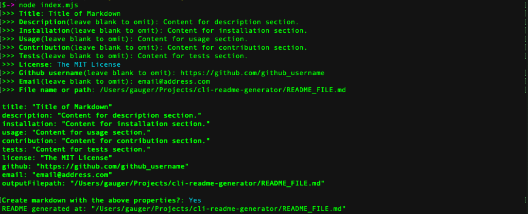

# CLI Readme Generator

Generate a readme markdown file via an interactive CLI.

## Usage

The user is presented with a series of prompts they can answer to configure the
content of the generated markdown file. All input has leading and trailing white
space trimmed. Some prompts are optional and are designated as such. These
prompts are omitted if no input is given for them.

## Prompts

The following are the main questions prompted to the user to generate the
markdown file:

1. **Title**

   The `title` prompt sets the `h1` header element on the first line of the
   generated markdown. Non blank input is required for this prompt.

1. **Description**

   The `description` prompt sets the text content of the *Description* section.
   It can optionally be left blank to be omitted from the generated markdown.

1. **Installation**

   The `installation` prompt sets the text content of the *Installation* section.
   It can optionally be left blank to be omitted from the generated markdown.

1. **Usage**

   The `usage` prompt sets the text content of the *Usage* section.
   It can optionally be left blank to be omitted from the generated markdown.

1. **Contribution**

   The `contribution` prompt sets the text content of the *Contributing* section.
   It can optionally be left blank to be omitted from the generated markdown.

1. **Tests**

   The `tests` prompt sets the text content of the *Tests* section.
   It can optionally be left blank to be omitted from the generated markdown.

1. **license**

   The `license` prompt presents the user a list of licenses to choose from that
   sets the *license shield link image* located near the top of the generated
   markdown as well as the *license name* in the *License* section.

1. **Github**

   The `github` prompt sets the Github profile that is linked to as a contact in
   the *Questions* section. It can optionally be left blank to be omitted from
   the generated markdown.

1. **Email**

   The `email` prompt sets the email address that is linked to as a contact in
   the *Questions* section. If non empty input is given, it is required to have a
   single att, `'@'`, character, at least 1 period, `'.'`, character and can't
   contain any white space. It can optionally be left blank to be omitted from
   the generated markdown.

1. **Output Filepath**

   The `outputFilepath` prompt sets the file name/path of the generated markdown
   file. Non blank input that can be resolved to a path that doesn't exist or
   points to an pre-existing file to overwrite is required.

An invalid output file name/path will result in the user being reprompted for a
file name/path. If a negative response is given for the final confirmation step,
then the user is given the option to change previous answers to prompts.

## Examples

Below are some example screen shots of a typical use case of this CLI
application:

The above settings would generate a markdown file with the following content:

